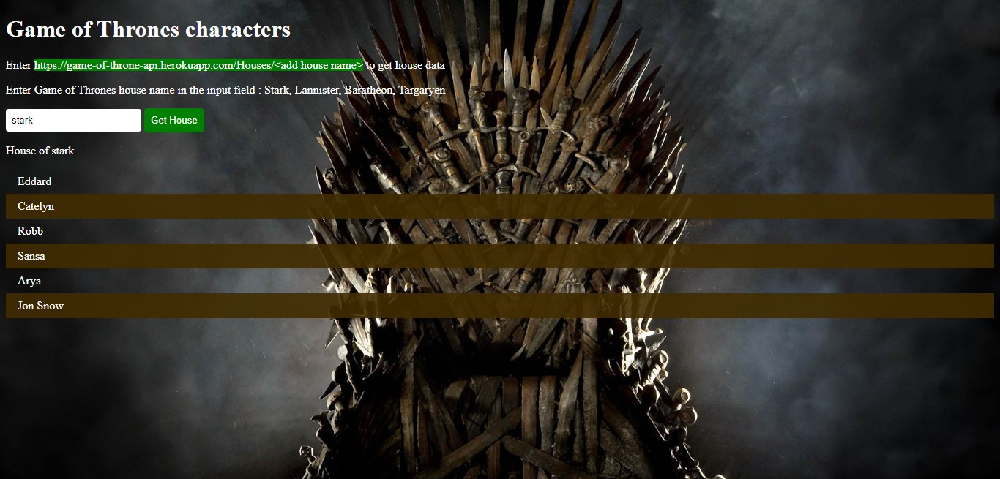

# Game of Throne API
A an api that shows Game of Thrones house character.

**Link to project:** https://game-of-throne-api.herokuapp.com/

## How It's Made:

**Tech used:** HTML, CSS, JavaScript, Node.js Express

This api runs on Node.js with the help of express. When you send a request to the /houses page it return a json object with character list. Each house has a name and a code.

The html, css and javascript files serve as a landing page with documentation on how to use the api 

## Optimizations

I consistenly refactor and optimize my code, I would like to add image of each house characters for better UI for the users.

## Lessons Learned:

I learned how to use node to serve json data with express framework. I also learned to deploy a project to heroku via the command line.

